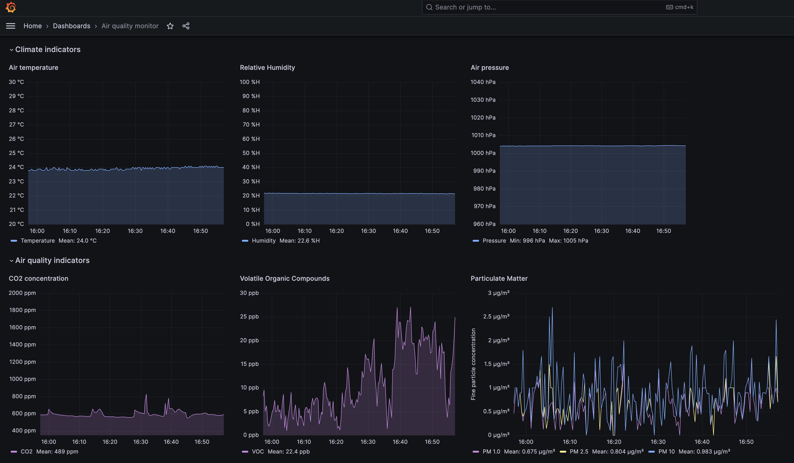
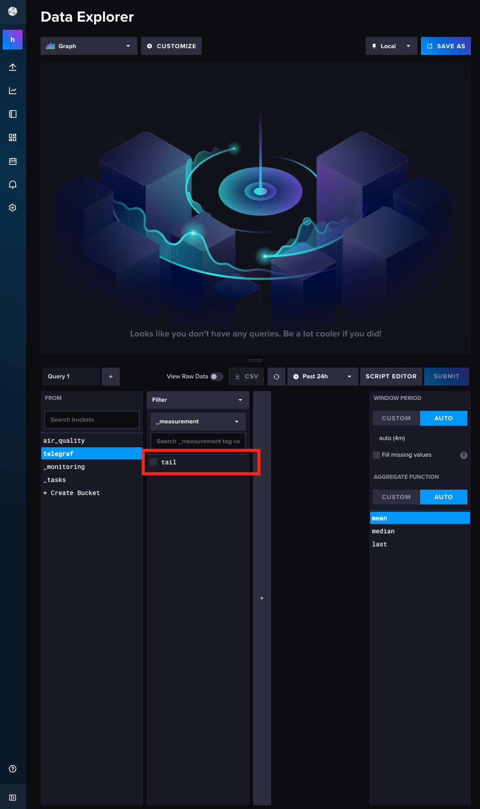

# Air quality monitor with grafana dashboard

## Hardware Assembly
The sensors are connected to an Arduino with shield. All sensors are mounted on a small plate that can be made by Oshcut, for example. The design for the small plate is in the `hardware` folder in this repository.

## Software Installation Instructions
These installation instructions were tested on a Mac Mini with Apple M2 silicon chip set, as well as an older Apple Macbook Pro with Intel chip set. If trying to install on Windows or Linux, use your best judgment to replace commands as needed.

The final dashboard should look something like this:



### Arduino
1. Follow the instructions here to install the proper Arduino libraries: https://github.com/danielbernalb/LibreCO2
2. Upload the code in the `co2_sensor` folder to the Arduino. 
3. The display on the Arduino shield should light up and a countdown sequence should begin. After this it should already display the CO2 value. Now we have to read this out with python.

### Python
1. Create a new environment in anaconda using `conda create --name aqi_mon` for example.
2. `conda activate aqi_mon`
2. `pip install jupyter lab`
3. `pip install visdom`
3. `pip install serial`. Note: do not accidentally install pyserial.
4. Clone the following repository https://github.com/gkoolstra/liveplot 
4. Add the environment to the jupyter notebook using `python -m ipykernel install --user --name=aqi_mon`
6. Test your notebook by firing up the notebook server `jupyter notebook` and open the `.ipynb` file.
7. Still in the terminal, fire up the `visdom` client and navigate to http://localhost:8097 This is the liveplot client that checks whether data is coming in over the serial connection from the Arduino.
7. Select the proper USB port. You can either read this from the Arduino IDE, or by using the scan feature in the notebook. 
8. If the loop runs successfully, data should start to appear on the Visdom tab in your browser, and the log files will be populated now. Make sure this part is functioning properly before continuing.


Before proceeding make sure you have homebrew installed: https://brew.sh/

### Telegraf
We use Telegraf to write into the timeseries database.
1. Follow the directions here to install telegraf: https://docs.influxdata.com/telegraf/v1/install/?t=macOS
2. After installataion, we have to replace the configuration file. For Apple silicon, use Finder to navigate to `/opt/homebrew/etc`. Make sure to show hidden files and folders using `cmd` + `Shift` + `.`, otherwise this folder won't be visible.
3. Rename the existing `telegraf.conf` file to `__telegraf.conf`
4. Paste the new `telegraf.conf` file into this folder.
5. Note: don't be alarmed if the command `telegraf` does not work yet at this moment. We need to update the `TELEGRAF_CONFIG_PATH` environment variable first, see the section below.

### Influxd
InfluxDB stores the timeseries database. 
1. Follow the directions here to install InfluxDB: https://docs.influxdata.com/influxdb/v2/install/
2. `brew update`
3. `brew install influxdb`
4. Open a terminal and type `influxd` to launch an instance. Then use your browser to navigate to http://localhost:8086
5. Choose a username and password. When shown the __admin token__, write this down! You'll need it later.
6. As your organization choose `home`. The bucket here doesn't matter too much, we'll create a new one.
7. Create a _new_ bucket called `telegraf`. To do this, in InfluxDB choose Telegraf > Create configuration. Choose "Create a bucket" and search for "Telegraf Internal" as a source. Continue, the API token that's displayed is not necessary for grafana. We need the admin token instead.

### Terminal homework
1. Update your source file for the terminal. The file we want to create is `~/.zshenv`, so in the terminal type `touch ~/.zshenv` followed by `open -a TextEdit.app ~/.zshenv`
2. Add the following four lines to your `~/.zshenv` file, replacing the first placeholder with the __full path__ to the `data` directory in `python` subfolder in this repo. Note: make sure this path doesn't contain spaces. The last line should be replaced with the InfluxDB admin token.
```
export TELEGRAF_CONFIG_PATH=/opt/homebrew/etc/telegraf.conf
export TELEGRAF_BACKFILL=false
export TELEGRAF_FRIDGE_LOGDIR=[full path to data folder, don't terminate with slash]
export INFLUX_TOKEN=[replace with admin token]
```
3. Restart the terminal and test if the changes have gone into effect: `echo $TELEGRAF_CONFIG_PATH` should not come back empty.

4. Test `telegraf` in a terminal window, if things are working properly, Telegraf should now be reading your log files and as the log file grows new lines will be printed in the terminal. 
5. Check `InfluxDB` that data is being written to the database. In the `telegraf` bucket, there should now be an entry `tail`, as shown in the picture below:


Make sure these steps are working before proceeding.

### Grafana
Grafana displays the dashboard and only acts as the face to the database. At this stage you can be creative to design your own pretty graphics.
1. To install grafana use homebrew in the terminal: `brew install grafana`
2. Launch grafana: `brew services start grafana`
3. In your browser, navigate to http://localhost:3000
4. First time users may use username = admin, password = admin to create a new password. 
5. We now have to connect influxDB to Grafana. In the main screen, choose "Add your first data source". Search for "InfluxDB". (a) Change the "Query Language" to "Flux". (b) Set the URL to http://localhost:8086 (c) Set the organization to `home` (d) Paste the admin token into the Token field. (e) Choose your bucket as `telegraf`
6. Verify grafana can access the InfluxDB database by clicking `Save & test`. A green message should appear, if not check your settings. 
7. Create a new dashboard and add a first visualization. This is where the artistic part comes in. First we have to query the data in the flux language. Below there is a sample query that can be used to select the `co2_ppm` data from the time series data base in InfluxDB. The last line drops the property `path`, which is helpful for plotting data from several datafiles (days). For more help with Flux, see https://docs.influxdata.com/influxdb/v2/query-data/get-started/ 
```
from(bucket: "telegraf")
    |> range(start: -24h)
    |> filter(fn: (r) => r._field == "co2_ppm")
    |> drop(columns: ["path"])
```

### Making your life easier
When you restart your computer, you don't necessarily want to remember all these commands to restart the server. Instead they're nicely packaged in the file `start_aqi_monitor.sh`. You can run this from the terminal as follows: 
```
sh start_aqi_monitor.sh
```
It assumes you have Google Chrome as your browser. Happy monitoring!